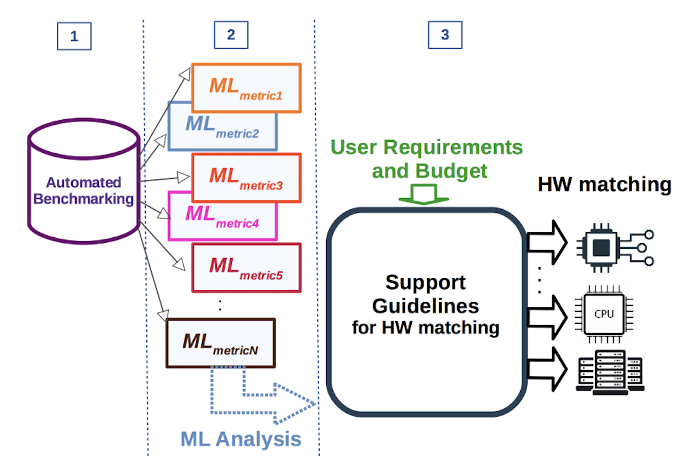

# Benchmarking for Automation

AI engineers must prioritize optimizing system performance, considering overall
latency, solution quality, power consumption, and space utilization. Evaluating
new AI algorithms often involves assessing their performance on standardized
public benchmark problems.  

Benchmarking is of crucial importance for the selection of the optimal HW
resources given a specific AI application to be executed on a potential array of
different computing resources and a set of user requirements and budget. In this
case, both AI experts and new adopters might struggle to find what is the HW
most suited to their specific needs (and possibly the configuration of the
algorithm itself).

## Importance of Benchmarking

Benchmarks provide crucial insights into how well an algorithm performs on
specific systems.  This is especially true given current system variability, as
AI algorithms deployed on different systems exhibit varied performance, making
it essential to test across multiple heterogeneous platforms.

## Challenges in AI Adoption

 - Uncertain Performance: Potential adopters face uncertainty due to performance
   data being limited to specific public benchmarks and hardware platforms.
 - Comprehensive Evaluation: Understanding an AI application’s behavior across
   different systems is vital for informed decision-making.

## Automated Matching of an AI Asset to Hardware Resources

We assume to have a AI asset (algorithm, data-centric model, pipeline, etc.)
that needs to be matched to the optimal hardware (HW) resources.

The steps to implement a potential automated routine for HW matching are:
1. The asset is benchmarked on a variety of HW devices and with a variety of
   hyperparameters combinations.
2. The benchmark results are  used to characterise  behaviour of a given  AI
   asset under different configurations and the resulting data set is used to
train ML models that learn this behaviour.
3. The requirements of the user (e.g., budget, asset’s performance, etc) are
   matched with a most suitable HW platform, and benchmarks, so that expected
behaviour of the AI asset is chosen (this selection can happen via guidelines or
more automated processes, such as casting it as an optimization problem)

